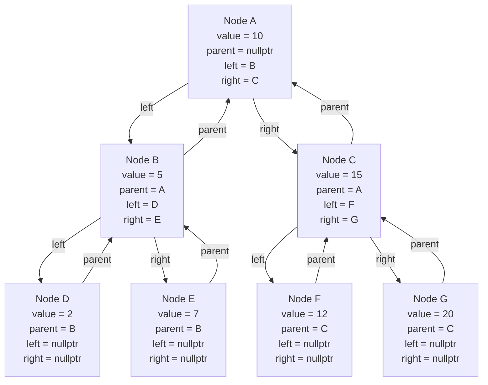
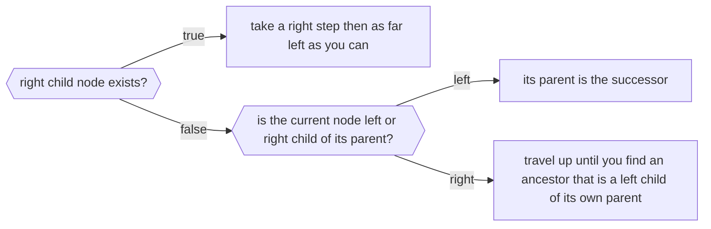
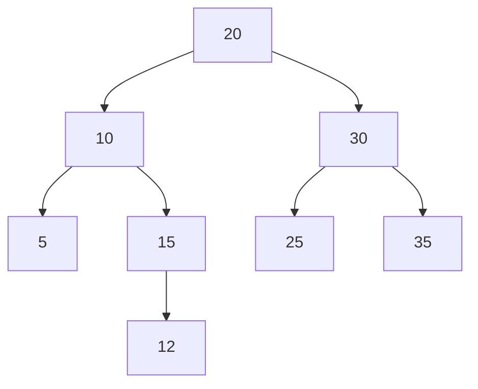

## Binary Search Tree Rules

Let `x` be a node in the BST:
- if `y` is a node in the left subtree of `x`, then `y.key` $<$ `x.key`.
- if `y`. is a node in the right subtree of `x`, then `y.key` $\ge$ `x.key`.

## Successor

The `successor` of a node is the node that will come right after the specified node in an [[Tree Traversal Orders|Inorder Traversal]].

#### How to find?

Example:

Sample node: `10`
Its successor: `12`