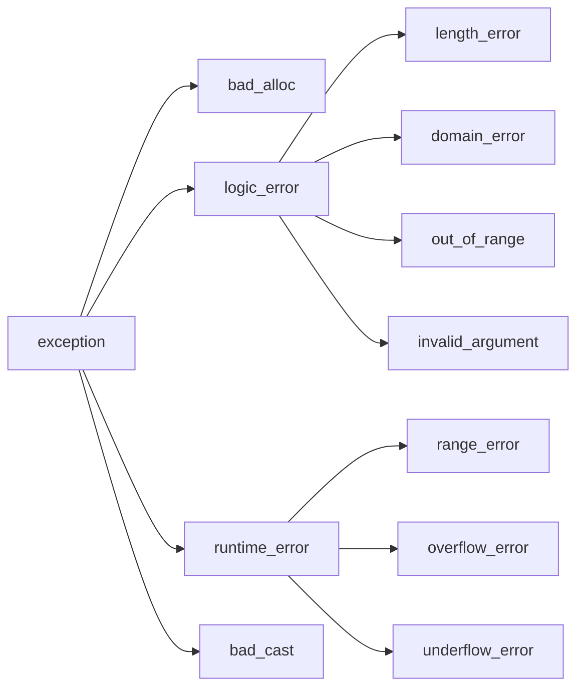

## All Errors
|Stage / Category|Typical errors|When detected|
|---|---|---|
|**Preprocessor error**|Missing header, malformed `#include`, bad macro usage, `#error` directive|Before actual compilation|
|**Syntax error**|Missing `;`, unmatched braces, malformed expression|During compilation|
|**Semantic / type error**|Undeclared variable, incompatible types, invalid function call, inaccessible member|During compilation|
|**Template / `constexpr` compile-time error**|Failed template substitution, invalid instantiation, failed `static_assert`, invalid constant expression|During compilation|
|**Linker error**|Undefined function, missing library, duplicate definition, unresolved symbol|After compilation, before executable is produced|
|**Loader / startup error**|Missing shared library/DLL, incompatible library version, executable format problem|When the OS tries to start the executable|
|**Runtime error**|Exception, allocation failure, file-open failure, arithmetic/domain failure|While the program is running|
|**Undefined behavior**|Out-of-bounds access, dangling pointer, signed integer overflow, invalid dereference|Usually while running; may appear to work or fail unpredictably|
|**Logic error**|Program runs but computes the wrong answer because the algorithm is wrong|Usually discovered through testing/debugging|
|**Resource / environment error**|Out of memory, disk full, permission denied, network unavailable|Usually during runtime|
|**Concurrency error**|Data race, deadlock, race condition|During runtime, often intermittently|

## Exceptions (std::exception)
