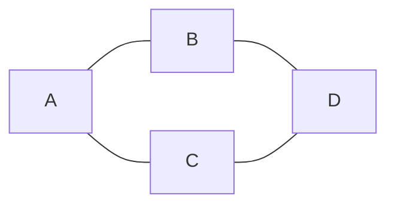

There are two standard ways to represent a graph:

- `Adjacency Matrix`
- `Adjacency List`

Example graph:



Edges:

```text
A-B
A-C
B-D
C-D
```

### Adjacency Matrix

Uses a 2D matrix to record whether two vertices are connected.

```text
    A B C D
A   0 1 1 0
B   1 0 0 1
C   1 0 0 1
D   0 1 1 0
```

Interpretation:

```text
matrix[A][B] = 1
→ A and B are adjacent

matrix[A][D] = 0
→ A and D are not adjacent
```

For an undirected graph, the matrix is symmetric:

```text
matrix[A][B] = matrix[B][A]
```

Properties:

- Edge lookup is very fast: `O(1)`
- Requires about `O(V²)` storage
- Often appropriate for `dense graphs`

---

### Adjacency List

Stores the neighbors of each vertex.

```text
A → [B, C]
B → [A, D]
C → [A, D]
D → [B, C]
```

For example:

```text
A → [B, C]
```

means:

```text
A-B exists
A-C exists
```

Because the graph is undirected:

```text
A lists B
B also lists A
```

Properties:

- Uses about `O(V + E)` storage
- Efficient for visiting all neighbors of a vertex
- Often appropriate for `sparse graphs`

---

## Comparison

Let:

- `V` = number of vertices
- `E` = number of edges
- `degree(v)` = number of vertices directly adjacent to vertex `v`

| Representation | Space | Add edge `v-w` | Check whether `w` is adjacent to `v` | Iterate through vertices adjacent to `v` | Best suited for |
|---|---|---|---|---|---|
| Adjacency List | `O(V+E)` | `O(1)` | `O(degree(v))` | `O(degree(v))` | Sparse graphs |
| Adjacency Matrix | `O(V²)` | `O(1)` | `O(1)` | `O(V)` | Dense graphs |