## Graph Object

A `Graph` object contains two sets:

- `V`: a finite, non-empty set of vertices
- `E`: a set of edges
  - `E` may be empty
  - each edge establishes a connection between vertices in `V`

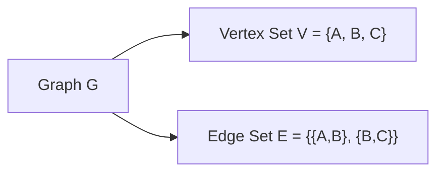

Equivalent graph:

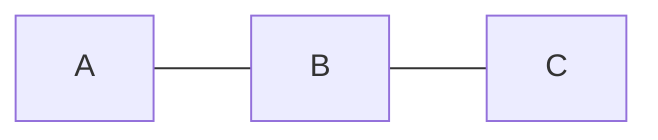

---

## Terminology Summary

| Term | Meaning |
|---|---|
| `Graph` | A structure consisting of a vertex set `V` and an edge set `E` |
| `Vertex` | An individual node in a graph |
| `Edge` | A connection between two vertices |
| `Directed graph` | A graph whose edges record direction |
| `Undirected graph` | A graph whose edges do not record direction |
| `Simple graph` | A graph with no loops and no multiple edges between the same pair of vertices |
| `Multigraph` | A graph that permits multiple edges between the same pair of vertices |
| `Loop` | An edge connecting a vertex to itself |
| `Cycle` | A closed path that returns to its starting vertex |
| `Path` | A sequence of vertices where each consecutive pair is connected by an edge |
| `Path length` | Number of edges in a path |
| `Cycle length` | Number of edges in a cycle |
| `Connected graph` | A graph in which a path exists between every pair of vertices |
| `Disconnected graph` | A graph in which at least one pair of vertices has no connecting path |
| `Connected component` | A maximal connected subgraph of a disconnected graph |
| `Acyclic graph` | A graph containing no cycles |
| `Tree` | A connected, acyclic, undirected graph |
| `Subgraph` | A graph formed from a subset of another graph's vertices and edges |
| `Adjacent vertices` | Two vertices directly connected by an edge |
| `Neighbor` | A vertex adjacent to another vertex |
| `Incident edge` | An edge connected to a given vertex |
| `Degree` | Number of edges incident to a vertex in an undirected graph |
| `In-degree` | Number of directed edges entering a vertex |
| `Out-degree` | Number of directed edges leaving a vertex |
| `Density` | Proportion of all possible edges that are actually present |
| `Sparse graph` | A graph containing relatively few of its possible edges |
| `Dense graph` | A graph containing relatively many of its possible edges |
| `Complete graph` | A simple graph in which every pair of distinct vertices is adjacent |
| `Isolated vertex` | A vertex with degree `0` |
| `Pendant vertex` | A vertex with degree `1` |
| `Leaf` | A degree-1 vertex in a tree, except the single-vertex-tree edge case |
| `Walk` | A sequence of adjacent vertices in which vertices and edges may repeat |
| `Trail` | A walk in which no edge is repeated |
| `Bridge` | An edge whose removal increases the number of connected components |

---

## Directed Graph

A `directed graph` records the direction of each connection.

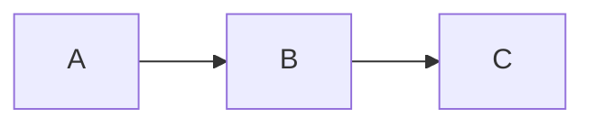

Here:

```text
A → B
```

is different from:

```text
B → A
```

The edge has a specific direction.

---

## Undirected Graph

An `undirected graph` records only that two vertices are connected, not a direction.


Here:

```text
A — B
```

means `A` and `B` are connected symmetrically.

---

## Simple Graph

A `simple graph` has:

- no loops
- no multiple edges between the same pair of vertices
- every edge connects two distinct vertices

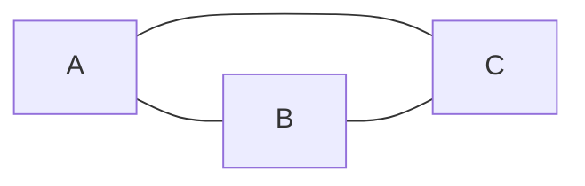

Valid:

```text
A — B
A — C
B — C
```

Invalid in a simple graph:

```text
A — A        loop

A ══ B       multiple edges between A and B
```

---

## Multigraph

A `multigraph` allows multiple edges between the same pair of vertices.

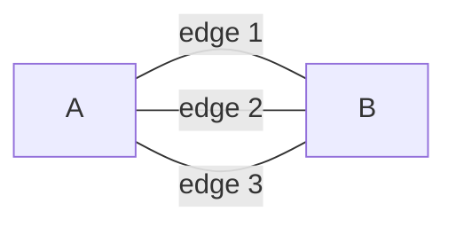

Here, `A` and `B` are connected by three distinct edges.

```text
A ───── B
A ───── B
A ───── B
```

---

## Loop

A `loop` is an edge that connects a vertex to itself.

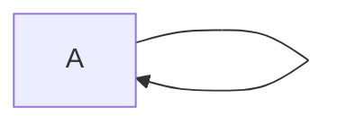

Conceptually:

```text
A ↺
```

The edge begins and ends at the same vertex.

---

## Cycle

A `cycle` is a path that starts at a vertex, follows edges through other vertices, and eventually returns to the starting vertex.

Example:

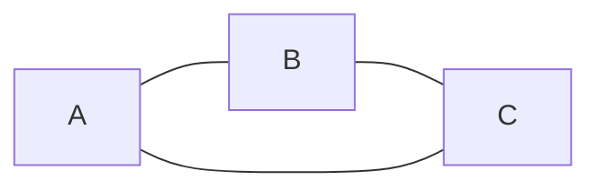

Cycle:

```text
A → B → C → A
```

For a simple undirected graph, the smallest possible cycle contains three distinct vertices:

```text
A
|\
| \
|  \
B---C
```

---

## Path

A `path` is a sequence of vertices where each consecutive pair is connected by an edge.

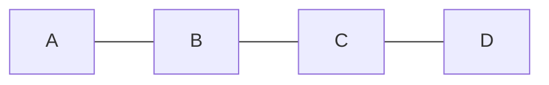

Example path:

```text
A → B → C → D
```

This path contains:

```text
4 vertices
3 edges
```

---

## Path / Cycle Length

The `length` of a path or cycle is the number of edges traversed.

```text
A → B → C → D

length = 3
```

For the cycle:

```text
A → B → C → A

length = 3
```

---

## Connected Graph

A graph is `connected` if a path exists between every pair of vertices.

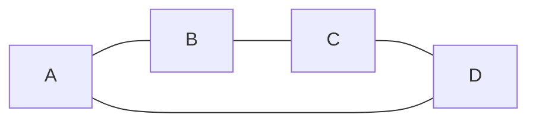

Examples:

```text
A → B → C
B → A → D
C → D
```

Every vertex can reach every other vertex.

---

## Disconnected Graph

A graph is `disconnected` if at least one pair of vertices has no path connecting them.

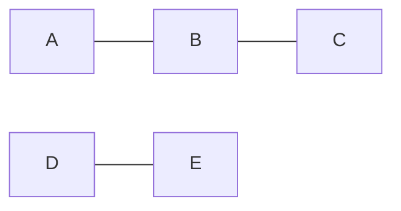

There is no path from a vertex in:

```text
{A, B, C}
```

to a vertex in:

```text
{D, E}
```

---

## Connected Component

A `connected component` is a maximal connected subgraph of a disconnected graph.

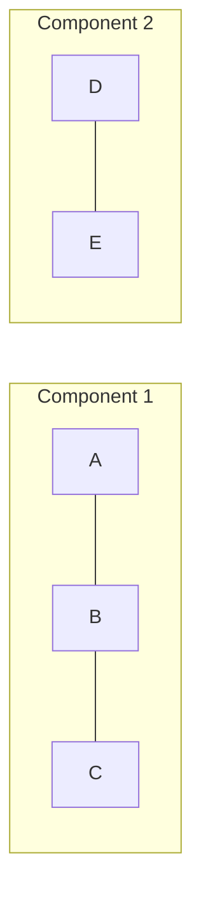

The graph has two connected components:

```text
{A, B, C}
{D, E}
```

---

## Acyclic Graph

An `acyclic graph` contains no cycles.

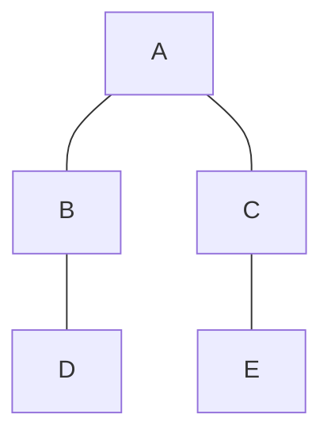

There is no path that follows distinct edges and returns to its starting vertex.

---

## Tree

A `tree` is a connected, acyclic, undirected graph.

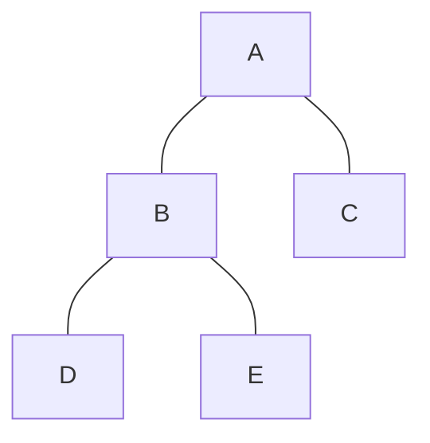

A tree therefore has:

- no cycles
- exactly one path between every pair of vertices
- `|E| = |V| - 1`

Example:

```text
5 vertices
4 edges
```

---

## Subgraph

A `subgraph` is formed from a subset of a graph's vertices and edges, where every included edge has its endpoints included.

Original graph:


One possible subgraph:


The subgraph is itself a valid graph.

---

## Adjacent Vertices

Two vertices are `adjacent` if an edge directly connects them.

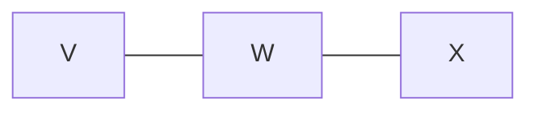

Here:

```text
V is adjacent to W
W is adjacent to V
W is adjacent to X
V is not adjacent to X
```

For an undirected graph:

```text
V adjacent to W ⇔ edge {V,W} exists
```

---

## Neighbor

A `neighbor` of a vertex is a vertex adjacent to it.

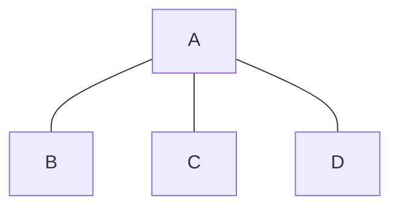

The neighbors of `A` are:

```text
{B, C, D}
```

---

## Degree

The `degree` of a vertex in an undirected graph is the number of edges incident to that vertex.


```text
degree(A) = 3
degree(B) = 1
degree(C) = 1
degree(D) = 1
```

Notation:

```text
deg(A) = 3
```

A loop normally contributes `2` to the degree of its vertex.

---

## In-Degree and Out-Degree

For a directed graph:

- `in-degree`: number of directed edges entering a vertex
- `out-degree`: number of directed edges leaving a vertex

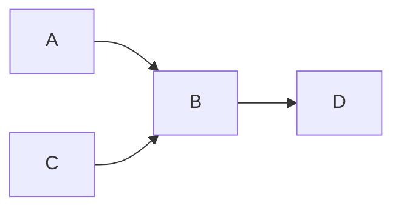

For `B`:

```text
in-degree(B) = 2
out-degree(B) = 1
```

---

## Incident Edge

An edge is `incident` to each vertex it connects.

```mermaid
graph LR
A["A"] ---|e| B["B"]
```

Edge `e` is incident to both:

```text
A
B
```

---

## Graph Density

The `density` of a graph measures what proportion of all possible edges are actually present.

For a simple undirected graph with:

```text
n = number of vertices
m = number of edges
```

the maximum possible number of edges is:

```text
n(n - 1) / 2
```

so:

```text
density = m / (n(n - 1)/2)
```

Equivalent:

```text
density = 2m / (n(n - 1))
```

Density ranges from:

```text
0 → no edges
1 → every possible edge exists
```

---

## Sparse Graph

A `sparse graph` contains relatively few of its possible edges.

```mermaid
graph LR
A["A"] --- B["B"]
B --- C["C"]
C --- D["D"]
D --- E["E"]
```

Most possible pairs of vertices are not directly connected.

```text
low density
```

---

## Dense Graph

A `dense graph` contains most of its possible edges.

```mermaid
graph TD
A["A"] --- B["B"]
A --- C["C"]
A --- D["D"]
B --- C
B --- D
C --- D
```

For four vertices, this graph contains every possible edge.

```text
density = 1
```

This particular graph is also called a `complete graph`.

---

## Complete Graph

A `complete graph` is a simple graph in which every pair of distinct vertices is adjacent.

```mermaid
graph TD
A["A"] --- B["B"]
A --- C["C"]
A --- D["D"]
B --- C
B --- D
C --- D
```

A complete graph with `n` vertices has:

```text
n(n - 1) / 2
```

edges.

Notation:

```text
K_n
```

For example, the graph above is:

```text
K_4
```

---

## Isolated Vertex

An `isolated vertex` has degree `0`.

```mermaid
graph LR
A["A"] --- B["B"]

C["C"]
```

```text
deg(C) = 0
```

---

## Pendant / Leaf Vertex

A `pendant vertex` has degree `1`.

```mermaid
graph LR
A["A"] --- B["B"] --- C["C"]
```

```text
deg(A) = 1
deg(C) = 1
```

In trees, these vertices are usually called `leaves`.

---

## Walk

A `walk` is a sequence of adjacent vertices in which vertices and edges may be repeated.

Example:

```text
A → B → C → B → D
```

A walk is less restrictive than a path.

---

## Trail

A `trail` is a walk in which no edge is repeated.

Vertices may still repeat.

```text
walk
→ vertices and edges may repeat

trail
→ edges cannot repeat

path
→ vertices cannot repeat
```

---

## Bridge

A `bridge` is an edge whose removal increases the number of connected components.

```mermaid
graph LR
A["A"] --- B["B"]
B --- C["C"]
C --- D["D"]
```

Every edge in this particular graph is a bridge.

For example, removing:

```text
B — C
```

splits the graph into:

```text
{A, B}
{C, D}
```