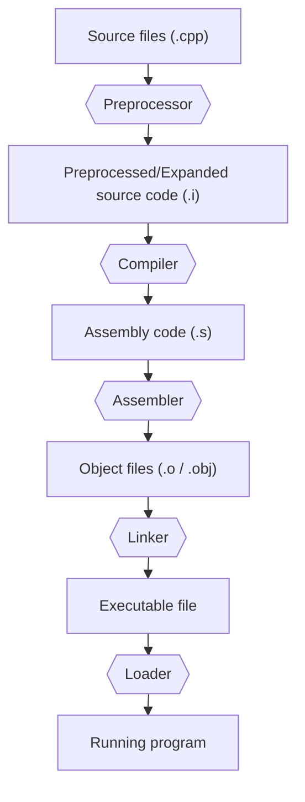

The overall process can be visualized as:



---

## **1. Preprocessing your source code**

Before the compiler actually compiles a `.cpp` source file, the **preprocessor** processes all of the preprocessor directives in that file.

Preprocessor directives begin with `#`.

Common examples include:

```cpp
#include <iostream>
#define PI 3.14159
#ifdef DEBUG
#endif
```

The preprocessor works on each source file separately.

Its major jobs include:

#### **A. Expanding `#include` directives**

When the preprocessor encounters:

```cpp
#include <iostream>
```

it makes the declarations provided by the corresponding header available as part of the translation process.

Conceptually, you can think of an `#include` directive as causing the contents of the specified header to be incorporated into the source file before compilation, although the exact implementation is handled by the compiler toolchain.

For example:

```cpp
#include "math.h"
```

allows declarations contained in `math.h` to be visible in that source file.

---

#### **B. Expanding macros**

For example:

```cpp
#define MAX_SIZE 100
```

causes occurrences of `MAX_SIZE` handled by the macro system to be replaced according to the macro definition before normal compilation.

For example:

```cpp
int array[MAX_SIZE];
```

is effectively processed as:

```cpp
int array[100];
```

---

#### **C. Handling conditional compilation**

The preprocessor can include or exclude sections of source code depending on specified conditions.

For example:

```cpp
#ifdef DEBUG
    std::cout << "Debug mode\n";
#endif
```

The enclosed code is compiled only when `DEBUG` is defined.

Conditional compilation commonly uses directives such as:

```text
#if
#ifdef
#ifndef
#elif
#else
#endif
```

---

#### **D. Producing the preprocessed source**

After the preprocessing directives have been handled, the resulting source code is passed to the compiler.

If preprocessing fails, the rest of the compilation process for that source file cannot continue.

Examples of preprocessing errors include:

- A requested header cannot be found.
    
- A preprocessing directive is malformed.
    
- A required macro condition fails.
    
- An explicit `#error` directive is encountered.
    

For example:

```cpp
#include <header_that_does_not_exist>
```

may produce an error such as:

```text
fatal error: header_that_does_not_exist: No such file or directory
```

---

## **2. Compiling your source code**

After preprocessing, the C++ compiler sequentially processes each source code `.cpp` file in your program.

For each source file, the compiler performs two major tasks:

1. The compiler checks your C++ code to make sure it follows the syntactic and semantic rules of the C++ language. If it does not, the compiler will give you an error, often with a corresponding file and line number, to help pinpoint what needs fixing. Compilation of that translation unit cannot successfully complete until the error is fixed.
    
2. The compiler translates your C++ code into lower-level machine instructions and associated information. These are stored in an intermediate file called an **object file**. The object file also contains other information required or useful in later stages, including information needed by the linker and, when enabled, debugging information.
    

Object files are typically named:

```text
name.o
```

on many Unix-like systems, or:

```text
name.obj
```

on Windows, where `name` is usually derived from the `.cpp` file that produced it.

For example:

```text
main.cpp
```

might compile into:

```text
main.o
```

or:

```text
main.obj
```

---

### **Each `.cpp` file is normally compiled separately**

Suppose your project contains:

```text
main.cpp
math.cpp
display.cpp
```

The compiler generally processes them independently:

```text
main.cpp
   ↓
main.o

math.cpp
   ↓
math.o

display.cpp
   ↓
display.o
```

At this stage, the compiler does not necessarily need the full definitions of functions located in other `.cpp` files.

It only needs enough declarations to verify that the source file is using those functions correctly.

For example:

```cpp
int add(int, int);

int main()
{
    int result = add(2, 3);
}
```

The compiler can compile this file because it knows that a function named `add` is supposed to exist and has the signature:

```cpp
int add(int, int);
```

The compiler does **not** need the definition of `add` to be located in this same `.cpp` file.

The responsibility for finding and connecting that definition comes later during **linking**.

---

## **Compiler errors**

Compiler errors can broadly be divided into several categories.

### **Syntax errors**

A syntax error occurs when the source code violates the grammatical structure of C++.

For example:

```cpp
int x = ;
```

or:

```cpp
if (x > 5
{
    std::cout << x;
}
```

The compiler cannot correctly interpret these statements.

---

### **Semantic errors**

The syntax may be grammatically valid, but the program may violate the meaning or rules of the C++ language.

For example:

```cpp
int x = "hello";
```

The syntax is valid, but a string literal cannot normally be directly assigned to an `int`.

Another example is:

```cpp
std::cout << y;
```

when `y` has never been declared.

---

### **Type errors**

Many semantic errors specifically involve incompatible types.

For example:

```cpp
void foo(int x)
{
}

int main()
{
    foo("hello");
}
```

The compiler knows that `foo()` requires an `int`, but `"hello"` is not an `int`.

---

### **Compile-time template and constant-expression errors**

Templates and compile-time calculations can also generate compiler errors.

For example:

```cpp
static_assert(sizeof(int) == 100);
```

If the condition is false, compilation fails.

Template code may similarly fail because a template cannot be instantiated with the supplied types.

---

## **3. Linking object files and libraries and creating the desired output file**

After the compiler has successfully produced the necessary object files, another program called the **linker** processes them.

The linker’s job is to combine the required object files and libraries and produce the desired output file, such as an executable file that can be run.

This process is called **linking**.

If linking fails, the linker generates an error message describing the issue and does not successfully produce the requested executable or library.

The linker performs several important tasks.

### **1. Reading the object files**

The linker reads the object files generated by the compiler.

For example:

```text
main.o
math.o
display.o
```

Each object file may contain:

- Machine code
    
- Data
    
- Symbol information
    
- References to definitions located elsewhere
    
- Relocation information
    
- Debugging information, when enabled
    

---

### **2. Resolving symbols and cross-file dependencies**

One of the linker's most important jobs is **symbol resolution**.

Suppose `main.cpp` contains:

```cpp
int add(int, int);

int main()
{
    return add(2, 3);
}
```

and `math.cpp` contains:

```cpp
int add(int a, int b)
{
    return a + b;
}
```

After compilation:

```text
main.cpp → main.o
math.cpp → math.o
```

`main.o` contains a reference saying, conceptually:

```text
I call a function named add, but its final location still needs to be determined.
```

`math.o` contains the actual definition of `add`.

The linker connects the reference in `main.o` to the definition in `math.o`.

Conceptually:

```text
main.o ──── reference to add() ────┐
                                   │
math.o ──── definition of add() ───┘
```

---

### **Undefined-reference linker errors**

If the linker cannot find a required definition, linking fails.

For example:

```cpp
void foo();

int main()
{
    foo();
}
```

If no definition of `foo()` exists anywhere in the files or libraries being linked, the compiler may successfully compile the source file because the declaration is valid.

However, the linker later fails because it cannot find the actual definition.

A linker might report something similar to:

```text
undefined reference to `foo()`
```

or:

```text
unresolved external symbol foo
```

This is a **linker error**, not a runtime error.

The executable has not been successfully created yet, so the program cannot begin running.

---

### **Multiple-definition linker errors**

The opposite problem can also occur: more than one conflicting definition of the same symbol may exist.

For example, suppose one source file contains:

```cpp
int x = 5;
```

and another source file also defines:

```cpp
int x = 10;
```

If these represent conflicting external definitions of the same entity, the linker may report a multiple-definition or duplicate-symbol error.

For example:

```text
multiple definition of `x`
```

---

### **3. Linking libraries**

The linker may also link your program with one or more **libraries**.

A library is a collection of previously compiled code packaged so that other programs can reuse it.

Libraries may contain implementations for:

- Standard-library functionality
    
- Mathematical functions
    
- Graphics
    
- Networking
    
- Operating-system APIs
    
- Third-party frameworks
    
- Your own reusable code
    

Instead of recompiling all of that source code every time, your program can link against the previously compiled library.

Libraries can broadly be divided into:

- **Static libraries**
    
- **Dynamic/shared libraries**
    

---

### **Static libraries**

With a static library, the linker copies the required library code into the final executable during linking.

Conceptually:

```text
Object files
     +
Static library
     ↓
   Linker
     ↓
Executable containing required library code
```

Common static-library extensions include:

```text
.a
```

on many Unix-like systems and:

```text
.lib
```

on Windows.

The resulting executable is generally less dependent on that static library being separately present at runtime, because the required code has already been incorporated into the executable.

---

### **Dynamic/shared libraries**

With dynamic linking, some library code remains in a separate file instead of being copied entirely into the executable.

Common examples include:

```text
.dll
```

on Windows,

```text
.so
```

on Linux, and:

```text
.dylib
```

on macOS.

The executable contains information allowing the required shared libraries and symbols to be located when the program is loaded or while it is running.

Conceptually:

```text
Executable
     +
Shared library
     ↓
Program at startup/runtime
```

---

### **4. Relocating addresses**

The machine code in separate object files may have been generated before the final locations of functions and global data are known.

The linker determines where the relevant code and data will be placed in the final output and adjusts references as necessary.

This process is called **relocation**.

For example, if one object file calls a function located in another object file, the linker ensures the call ultimately refers to the correct location in the final program.

---

### **5. Producing the final output**

After all required symbols and dependencies have been resolved, the linker produces the desired output file.

Typically this is an executable:

```text
program.exe
```

on Windows, or an executable file such as:

```text
program
```

on Unix-like systems.

However, the linker can also be used to produce a library instead of an executable, depending on the project configuration.

The pipeline so far is therefore:

```text
.cpp files
    ↓
Preprocessing
    ↓
Compilation
    ↓
.o / .obj files
    ↓
Linking
    ↓
Executable
```

---

## **4. Loading the executable**

Successfully producing an executable does **not** mean the CPU immediately begins executing `main()`.

When you launch the executable, the operating system and its **loader** must first prepare the program for execution.

Conceptually:

```text
Executable on disk
        ↓
Operating-system loader
        ↓
Program loaded into memory
        ↓
Runtime initialization
        ↓
main()
```

The exact process depends on the operating system and executable format, but the loader generally performs several important tasks.

### **1. Reading the executable**

The operating system examines the executable and verifies that it is in a format that can be loaded.

Common executable formats include:

```text
PE
```

on Windows,

```text
ELF
```

on Linux, and:

```text
Mach-O
```

on macOS.

---

### **2. Creating the process**

The operating system creates a new **process** for the program.

A process is a running instance of a program together with resources such as:

- Virtual address space
    
- Threads
    
- Open handles or file descriptors
    
- Security information
    
- Operating-system bookkeeping information
    

---

### **3. Mapping the program into memory**

The loader maps the executable's code and data into the process's virtual memory.

Conceptually, the process may contain regions for things such as:

```text
Code / text
Initialized global data
Uninitialized global data
Heap
Stack
Shared libraries
```

A simplified conceptual layout might look like:

```text
High addresses
┌────────────────────┐
│       Stack        │
│         ↓          │
│                    │
│         ↑          │
│        Heap        │
├────────────────────┤
│ Global/static data │
├────────────────────┤
│    Program code    │
└────────────────────┘
Low addresses
```

The exact layout is implementation- and operating-system-dependent.

---

### **4. Loading required shared libraries**

If the executable depends on dynamically linked libraries, those libraries must also be located and mapped into the process.

For example:

```text
program
   ↓
requires
   ↓
library.so
```

or:

```text
program.exe
   ↓
requires
   ↓
library.dll
```

If an essential shared library cannot be found or loaded, the program may fail before `main()` is ever reached.

This is a **loader/startup error**, rather than a compiler or linker error.

For example, an operating system might report that a required DLL or shared object cannot be found.

---

### **5. Performing runtime initialization**

Before your `main()` function begins, the language runtime and implementation may need to perform initialization.

Among other things, this can include initializing objects with static storage duration.

Therefore, the simplified statement:

```text
Program starts → main()
```

is useful but incomplete.

A more accurate conceptual sequence is:

```text
Launch executable
        ↓
Operating system loads program
        ↓
Runtime initialization
        ↓
Static initialization
        ↓
main()
```

---

## **5. Running the program**

Once loading and initialization are complete, control eventually reaches your program's `main()` function.

For example:

```cpp
int main()
{
    std::cout << "Hello, world!\n";
    return 0;
}
```

At this point, the program is in the **runtime** stage.

The CPU executes the machine instructions produced by the compiler and assembled into the executable by the linker.

While the program runs, it can:

- Perform calculations
    
- Read and write memory
    
- Allocate dynamic memory
    
- Read and write files
    
- Display output
    
- Receive user input
    
- Communicate over a network
    
- Call operating-system services
    
- Create additional threads
    
- Call functions from libraries
    

---

## **Runtime errors**

A program can compile and link successfully but still encounter problems while running.

These are broadly called **runtime errors**.

For example:

```cpp
#include <vector>

int main()
{
    std::vector<int> values;
    values.at(10);
}
```

This compiles and links successfully, but `at()` detects that index `10` is outside the vector and throws an exception at runtime.

If the exception is not handled, the program terminates.

Other runtime failures may involve:

- Failure to open a file
    
- Failure to allocate memory
    
- An uncaught exception
    
- Network failure
    
- Operating-system resource failure
    
- Invalid input
    
- Library failures
    

---

## **Undefined behavior**

**Undefined behavior** is especially important in C++.

Undefined behavior occurs when a program performs an operation for which the C++ standard imposes no requirements on what must happen.

For example:

```cpp
int array[3] = {1, 2, 3};

std::cout << array[100];
```

Accessing outside the bounds of the array causes undefined behavior.

The important point is that undefined behavior does **not** necessarily produce an error message.

The program might:

- Crash
    
- Print garbage
    
- Appear to work
    
- Produce different results on different computers
    
- Behave differently when compiler optimization is enabled
    
- Corrupt unrelated data
    
- Do essentially anything allowed by the surrounding execution environment
    

Therefore:

> Undefined behavior is not the same thing as a guaranteed runtime error.

Another example is dereferencing an invalid pointer:

```cpp
int* ptr = nullptr;
*ptr = 5;
```

Dereferencing a null pointer causes undefined behavior.

Although many systems will terminate such a program, C++ itself does not define a valid result for the operation.

---

## **Logic errors**

A **logic error** occurs when the program is valid C++ and runs successfully, but the programmer's algorithm or reasoning is wrong.

For example:

```cpp
int length = 5;
int width = 4;

int area = length + width;
```

If the intended calculation was the area of a rectangle, the correct expression should have been:

```cpp
int area = length * width;
```

However:

```cpp
length + width
```

is perfectly valid C++.

Therefore:

- The preprocessor reports no error.
    
- The compiler reports no error.
    
- The linker reports no error.
    
- The loader reports no error.
    
- The program may run normally.
    

It simply produces the wrong result.

Logic errors must therefore usually be found through:

- Testing
    
- Debugging
    
- Assertions
    
- Code review
    
- Checking program output
    

---

# Complete C++ processing pipeline

The full conceptual process can therefore be written as:

```text
C++ source files
      ↓
Preprocessing
      ↓
Preprocessed translation units
      ↓
Compilation
      ↓
Object files
      ↓
Linking
      ↓
Executable
      ↓
Loading
      ↓
Runtime initialization
      ↓
main()
      ↓
Program execution
      ↓
Program termination
```

A more detailed version is:

```text
main.cpp ──→ Preprocessor ──→ Compiler ──→ main.o ──┐
                                                    │
math.cpp ──→ Preprocessor ──→ Compiler ──→ math.o ──┼──→ Linker
                                                    │        │
other.cpp ─→ Preprocessor ──→ Compiler ──→ other.o ─┘        │
                                                             │
Libraries ────────────────────────────────────────────────────┘
                                                             ↓
                                                        Executable
                                                             ↓
                                                    Operating-system
                                                         loader
                                                             ↓
                                                    Runtime startup
                                                             ↓
                                                          main()
                                                             ↓
                                                     Program runs
                                                             ↓
                                                    Program terminates
```

---

# Summary of C++ error categories

|Stage / Category|Typical errors|When detected|
|---|---|---|
|**Preprocessor error**|Missing header, malformed preprocessing directive, explicit `#error`|During preprocessing|
|**Syntax error**|Missing `;`, malformed expression, unmatched braces|During compilation|
|**Semantic error**|Undeclared identifier, invalid operation, inaccessible member|During compilation|
|**Type error**|Incompatible types, invalid conversion, incorrect function arguments|During compilation|
|**Template / constant-expression error**|Invalid template instantiation, failed `static_assert`, invalid constant expression|During compilation|
|**Linker error**|Undefined reference, unresolved symbol, duplicate definition, missing linked library|During linking|
|**Loader / startup error**|Missing shared library, incompatible executable/library, loading failure|When launching the program|
|**Runtime error**|Uncaught exception, failed file operation, allocation failure, resource failure|While the program is running|
|**Undefined behavior**|Out-of-bounds access, invalid pointer dereference, signed integer overflow, use of certain invalid objects|Usually manifests during execution, but no diagnostic is guaranteed|
|**Logic error**|Wrong formula, incorrect condition, incorrect algorithm|Usually discovered through testing/debugging|
|**Resource / environment error**|Out of memory, disk full, permission failure, unavailable network resource|Usually during runtime|
|**Concurrency error**|Data race, deadlock, race condition|During runtime, often intermittently|

---

# Where each error stops the process

```text
Source code
    ↓
Preprocessor
    │
    └── Preprocessor error → STOP
    ↓
Compiler
    │
    └── Compilation error → STOP
    ↓
Object files
    ↓
Linker
    │
    └── Linker error → STOP
    ↓
Executable
    ↓
Loader
    │
    └── Loader/startup error → STOP
    ↓
Running program
    │
    ├── Runtime error
    ├── Undefined behavior
    ├── Resource/environment failure
    ├── Concurrency problem
    └── Logic error
```

---

# Compiler error vs linker error vs runtime error

These three are especially important to distinguish.

|Error type|Meaning|Example|
|---|---|---|
|**Compiler error**|The compiler cannot successfully translate the source because the program violates compile-time C++ rules|`int x = ;`|
|**Linker error**|Individual source files compiled, but the linker cannot combine them into the requested final program|`foo()` is declared and called but never defined|
|**Runtime error**|The program successfully compiled and linked, but something goes wrong while it is executing|An uncaught exception occurs|

Therefore, this statement is **incorrect**:

```text
Compiler → syntax errors
Linker → runtime errors
```

A better mental model is:

```text
Compiler
    → syntax errors
    → type errors
    → semantic errors
    → other compile-time errors

Linker
    → unresolved definitions
    → duplicate definitions
    → library/symbol linking problems

Runtime
    → problems that occur after the executable has started
```

---

# Declaration vs definition and why the linker is necessary

The distinction between a **declaration** and a **definition** is central to understanding compilation and linking.

A declaration tells the compiler that something exists.

For example:

```cpp
int add(int a, int b);
```

This tells the compiler:

```text
There is a function named add.
It takes two ints.
It returns an int.
```

A definition actually provides the function's implementation:

```cpp
int add(int a, int b)
{
    return a + b;
}
```

Therefore, one `.cpp` file can contain:

```cpp
int add(int, int);

int main()
{
    return add(2, 3);
}
```

while another `.cpp` file contains:

```cpp
int add(int a, int b)
{
    return a + b;
}
```

The first file can be compiled because the compiler has a valid declaration.

The linker later finds the definition in the second object's machine code and connects the two.

Thus:

```text
Declaration
    ↓
Allows the compiler to understand how something may be used

Definition
    ↓
Provides the actual entity/code

Linker
    ↓
Connects references to their definitions
```

---

# Headers and source files

A common C++ project structure is:

```text
main.cpp
math.cpp
math.h
```

`math.h` might contain declarations:

```cpp
#ifndef MATH_H
#define MATH_H

int add(int a, int b);

#endif
```

`math.cpp` might contain the corresponding definition:

```cpp
#include "math.h"

int add(int a, int b)
{
    return a + b;
}
```

`main.cpp` might use it:

```cpp
#include "math.h"

int main()
{
    return add(2, 3);
}
```

The conceptual processing is:

```text
main.cpp + math.h
        ↓
   Preprocessing
        ↓
     Compiler
        ↓
      main.o
         \
          \
           → Linker → Executable
          /
         /
      math.o
        ↑
     Compiler
        ↑
   Preprocessing
        ↑
math.cpp + math.h
```

The header normally provides the declaration to both source files, helping ensure that both source files agree on the function's interface.

The actual implementation remains in `math.cpp`.

---

# Translation units

After preprocessing, each `.cpp` file together with the declarations and other content made available through its included headers forms what is called a **translation unit**.

Conceptually:

```text
.cpp file
   +
included headers
   +
macro expansion
   +
conditional preprocessing
        ↓
Translation unit
        ↓
Compiler
        ↓
Object file
```

For example:

```text
main.cpp
    +
iostream
    +
math.h
    ↓
translation unit
    ↓
main.o
```

This explains why C++ projects can compile different `.cpp` files separately.

Each translation unit can be compiled independently into its own object file, and the linker later combines those object files.

---

# Why changing one `.cpp` file does not necessarily require recompiling everything

Because source files are normally compiled separately, changing one translation unit does not necessarily require recompiling unrelated translation units.

For example:

```text
main.cpp → main.o
math.cpp → math.o
graphics.cpp → graphics.o
```

If only `math.cpp` changes, a build system may only need to regenerate:

```text
math.cpp → math.o
```

and then link:

```text
main.o
math.o
graphics.o
    ↓
Linker
    ↓
Executable
```

This is one major reason large C++ programs are divided into multiple source files and use build systems to track dependencies.

---

# Final mental model

The most useful overall model is:

```text
1. Preprocessor
   Handles #include, macros, and conditional compilation.

2. Compiler
   Checks each translation unit and converts valid C++ into object code.

3. Linker
   Combines object files and libraries and resolves references between them.

4. Loader
   The operating system loads the executable and required shared libraries into memory.

5. Runtime
   Initialization occurs, main() begins, and the program executes.
```

Or, in one line:

```text
Source code → Preprocess → Compile → Object files → Link → Executable → Load → Run
```

And the corresponding error sequence is:

```text
Preprocessor error
        ↓
Compile-time error
        ↓
Linker error
        ↓
Loader/startup error
        ↓
Runtime problem
```

with **undefined behavior** and **logic errors** being especially important because they are not necessarily diagnosed automatically.