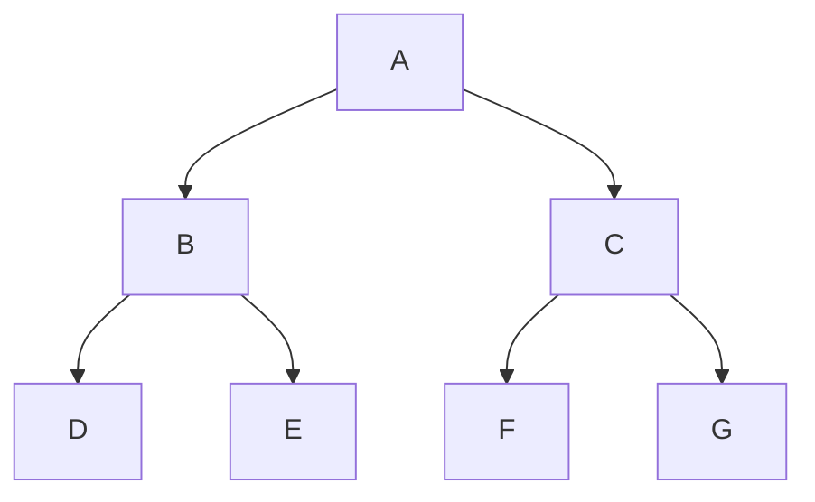

|Traversal|Rule|Order|
|---|---|---|
|**Preorder**|Root → Left → Right|`A B D E C F G`|
|**Inorder**|Left → Root → Right|`D B E A F C G`|
|**Postorder**|Left → Right → Root|`D E B F G C A`|
|**Level-order / BFS**|Level by level, left → right|`A B C D E F G`|