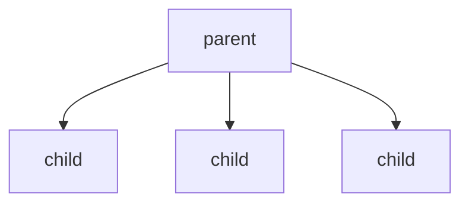
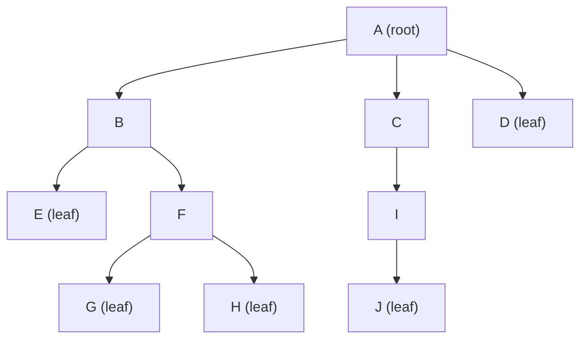
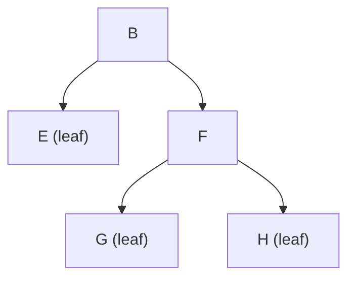
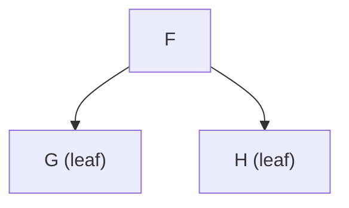

```mermaid
graph TD
A["node (root)"] --> B["node (leaf)"]
A --> C[node]
C --> D["node (leaf)"]
C --> E[node]
E --> F["node (leaf)"]
```

---



## Terminologies
- Each `parent node` can have multiple `child nodes`
- Each `child node` can only have one `parent node`
- `child nodes` with the same parent are called `siblings`
- `root`: The top most node
- Nodes without children are called `leaves`
- The `depth` of a node is the number of edges/traversals from the node to the root (==top-down==)
- The `height of a node` is the number of edges/traversals in the longest path from the node to a leaf (==bottom-up==)
- The `height` of a `leaf` is ==zero==
- The `height of the tree` is the number of edges/traversals in the longest path from the root to a leaf (==bottom-up==)
- A `subtree` is a tree wholly contained within another

## Example



### Parent / Child Relationships

- `A` is the parent of `B`, `C`, and `D`
- `B`, `C`, and `D` are children of `A`
- `B`, `C`, and `D` are siblings
- `B` is the parent of `E` and `F`
- `E` and `F` are siblings
- `F` is the parent of `G` and `H`
- `G` and `H` are siblings
- `C` is the parent of `I`
- `I` is the parent of `J`
- Every non-root node has exactly one parent

### Root

- `A` is the `root`
- The root is the top-most node in the tree
- The root has no parent

### Leaves

The `leaves` are:

- `D`
- `E`
- `G`
- `H`
- `J`

A leaf is a node with no children.

### Depth

The `depth` of a node is the number of edges from the root to that node.

| Node | Path from Root | Depth |
|---|---|---:|
| `A` | `A` | 0 |
| `B` | `A → B` | 1 |
| `C` | `A → C` | 1 |
| `D` | `A → D` | 1 |
| `E` | `A → B → E` | 2 |
| `F` | `A → B → F` | 2 |
| `I` | `A → C → I` | 2 |
| `G` | `A → B → F → G` | 3 |
| `H` | `A → B → F → H` | 3 |
| `J` | `A → C → I → J` | 3 |

Examples:

```text
depth(A) = 0
depth(B) = 1
depth(F) = 2
depth(G) = 3
```

### Height of a Node

The `height of a node` is the number of edges in the longest downward path from that node to a leaf.

All leaves have height `0`:

```text
height(D) = 0
height(E) = 0
height(G) = 0
height(H) = 0
height(J) = 0
```

For non-leaf nodes:

```text
height(F) = 1
```

because its longest path to a leaf is:

```text
F → G
```

or:

```text
F → H
```

Similarly:

```text
height(I) = 1
```

because:

```text
I → J
```

For `B`:

```text
B → F → G
```

contains 2 edges, so:

```text
height(B) = 2
```

For `C`:

```text
C → I → J
```

contains 2 edges, so:

```text
height(C) = 2
```

For the root `A`, the longest downward paths include:

```text
A → B → F → G
```

and:

```text
A → C → I → J
```

Each contains 3 edges, so:

```text
height(A) = 3
```

### Height of the Tree

The `height of the tree` is the height of the root.

Therefore:

```text
tree height = height(A) = 3
```

Equivalently, it is the number of edges in the longest path from the root to any leaf.

### Depth vs. Height

```text
Depth:
root → node

Height:
node → deepest leaf
```

For example, node `F`:

```text
A → B → F
```

has 2 edges, so:

```text
depth(F) = 2
```

Its longest path downward is:

```text
F → G
```

with 1 edge, so:

```text
height(F) = 1
```

Therefore:

```text
depth(F) = 2
height(F) = 1
```

Depth and height measure paths in opposite directions.

### Subtrees

A `subtree` consists of a node and all of its descendants.

For example, the subtree rooted at `B` is:



It contains:

```text
B, E, F, G, H
```

The subtree rooted at `F` is:



It contains:

```text
F, G, H
```

A leaf can also be viewed as a subtree containing only itself.

For example:

```text
subtree rooted at G = {G}
```

### Complete Relationship Summary

```text
A
├── B
│   ├── E
│   └── F
│       ├── G
│       └── H
├── C
│   └── I
│       └── J
└── D
```

- `A`
  - Root
  - Depth: `0`
  - Height: `3`

- `B`
  - Parent: `A`
  - Children: `E`, `F`
  - Sibling of: `C`, `D`
  - Depth: `1`
  - Height: `2`

- `C`
  - Parent: `A`
  - Child: `I`
  - Sibling of: `B`, `D`
  - Depth: `1`
  - Height: `2`

- `D`
  - Parent: `A`
  - Leaf
  - Sibling of: `B`, `C`
  - Depth: `1`
  - Height: `0`

- `E`
  - Parent: `B`
  - Leaf
  - Sibling of: `F`
  - Depth: `2`
  - Height: `0`

- `F`
  - Parent: `B`
  - Children: `G`, `H`
  - Sibling of: `E`
  - Depth: `2`
  - Height: `1`

- `G`
  - Parent: `F`
  - Leaf
  - Sibling of: `H`
  - Depth: `3`
  - Height: `0`

- `H`
  - Parent: `F`
  - Leaf
  - Sibling of: `G`
  - Depth: `3`
  - Height: `0`

- `I`
  - Parent: `C`
  - Child: `J`
  - Depth: `2`
  - Height: `1`

- `J`
  - Parent: `I`
  - Leaf
  - Depth: `3`
  - Height: `0`